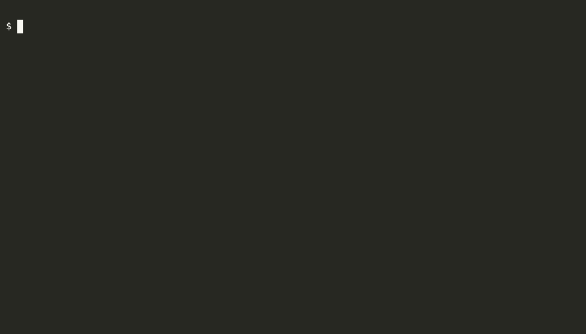
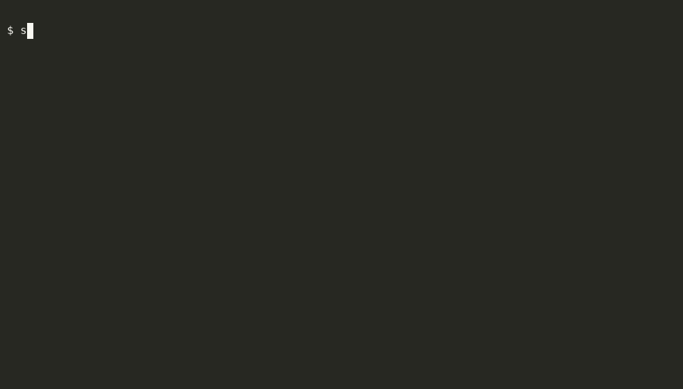

# skillctl

[English](README.md)

GitHub上のskillリポジトリを **Claude Code** / **Codex** へplugin としてimportするCLI。skillリポジトリ側で必要な`marketplace.json`・`plugin.json`を生成する機能も持つ。

- `skillctl import`: skillリポジトリのskillを、Claude Code・Codex・その両方へimportする。対話ピッカーと引数指定のどちらでも使える
- `skillctl generate`: `SKILL.md`から`.claude-plugin/marketplace.json`、各skillの`plugin.json`、必要ならCodex用の`agents/openai.yaml`を生成する。`--check`は生成物が古いと失敗するのでCIに向く

## デモ

非対話モード(`--yes`)でimportし、Claude Codeで確認するまで。



対話モード。一覧からskillを選び、import先を選ぶ。



## インストール

[Releases](https://github.com/sgash708/skillctl/releases)から、OS/archに合ったアーカイブ(`skillctl_<os>_<arch>.tar.gz`、Windowsは`.zip`)をダウンロードして展開し、`skillctl`をPATHの通った場所に置く。Goがあれば次でも入る。

```bash
go install github.com/sgash708/skillctl/cmd/skillctl@latest
```

`skillctl --version`で確認できる。Windows向けバイナリはビルドしているが、継続的なテストはしていない。

## import

```bash
# 対話モード: 一覧からskillを選び、import先も選ぶ
skillctl import --repo owner/skills

# 非対話モード
skillctl import <skill>... --repo owner/skills --target claude|codex|both --yes
```

| フラグ | 説明 |
| --- | --- |
| `--repo` | skillを管理しているGitHubリポジトリ(`owner/name`)。環境変数`SKILLCTL_REPO`でも指定できる |
| `--target` | `claude`・`codex`・`both`(デフォルト) |
| `--marketplace` | marketplace名。`generate --name`と揃える。省略時はリポジトリ名 |
| `--source` | marketplaceのsource。省略時は`https://github.com/<repo>`。ローカルディレクトリのパスも指定でき、skillリポジトリの開発中に使える |
| `-y`, `--yes` | 非対話モード。skill名が最低1つ必要 |

必要なもの: `--target`に応じた`claude`または`codex`のCLI(PATH上)。対話モードは[GitHub CLI](https://cli.github.com/)(`gh`)も使う。プライベートリポジトリなら`gh`のログインが要る。

プロキシ環境などで`https://github.com/...`に繋がらないときは、SSHのURLを渡すと通ることがある。

```bash
skillctl import <skill> --repo owner/skills --yes --source git@github.com:owner/skills.git
```

> **セキュリティ**: skillはエージェント内で動くpluginで、hook・スクリプト・MCPサーバを含められる。信頼できるリポジトリからだけimportし、入れる前に中身を読むこと。

## manifestの生成

skillリポジトリのルートで実行する。

```bash
skillctl generate --owner <owner> --name <marketplace名> [<root>]
```

`--owner`は必須。`--name`を省略するとルートのディレクトリ名になる。

想定する構成: ルート直下のサブディレクトリのうち、`SKILL.md`を持つものが1つのskill。`.`で始まるディレクトリは無視する。

```text
my-skills/
├── .claude-plugin/marketplace.json   # 生成される
├── code-review/
│   ├── SKILL.md
│   └── .claude-plugin/plugin.json    # 生成される
└── release-notes/
    ├── SKILL.md
    ├── scripts/                      # 他のファイルは自由に置ける
    └── agents/openai.yaml            # 条件を満たすときだけ生成される(下記)
```

`SKILL.md`のfrontmatterに`name`と`description`が要る。

```markdown
---
name: code-review
description: Review a diff for correctness bugs
---
```

Codex用の`agents/openai.yaml`は、frontmatterに`disable-model-invocation: true`か`codex:`セクションを書くと生成される。`codex:`には`display_name`・`short_description`・`icon_small`・`icon_large`・`brand_color`・`default_prompt`・`dependencies.tools`を書ける([Codex skills docs](https://developers.openai.com/codex/skills))。`icon_small`/`icon_large`はskillディレクトリからの相対パス(`./assets/icon.png`など)。

オプション:

- `--check`: 書き込まず、生成物が古ければ非0で終了する。CIで使う
- `--strict`: skillディレクトリに`SKILL.md`・`README.md`・`.claude-plugin/`・`agents/`・`assets/`(画像のみ、サブディレクトリ不可)以外があるとエラーにする。hookやMCP定義、スクリプトをリポジトリに入れたくないときに使う

## 開発

```bash
go test ./... -coverprofile=coverage.out
```

## ライセンス

[MIT](LICENSE)
